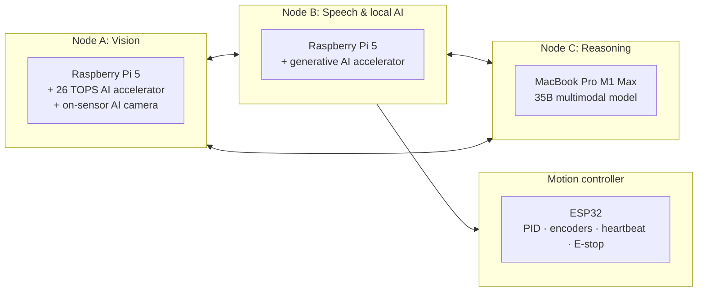

# SPARC: Solar Powered Autonomous Rover Companion

A solar-powered rover that sees, listens, talks, remembers people, and decides what to do on its
own. Everything runs on local hardware. No cloud.

The body is a Home Depot plastic storage container. Most of the electronics are repurposed from
earlier projects.

## How it's built

Three computers, one job each, on a local network. An ESP32 owns the motors so no software crash
can leave the wheels running.

- Power: 100 W solar panel, 256 Wh battery, 25 to 39 W typical draw. About 5.5 to 8.5 hours with
  no sun. Compute and motors run on separate fused rails.
- Perception: an on-sensor detector is always on for near zero power. A Qwen 3 vision model on
  the accelerator wakes on events. The 35B model runs only when asked.
- Decisions: the reasoning model proposes three actions, a small personality model picks one as a
  single token, and deterministic code re-checks the pick against live state before anything moves
  or speaks.
- Memory: faces stored as vectors and matched by cosine lookup. Events filed against relative
  time ("Nick came in right before he said hi").
- Motion: three layers, each able to veto the one above. ESP32 runs PID at 200+ Hz with a
  heartbeat watchdog. Lost heartbeat means stop within 500 ms. A hardware E-stop cuts the motor
  drivers.

## What works today

- Spoken conversation, wake word to spoken reply, all local
- Recognizes people by face, greets them by name, enrolls a new face by voice
- Long-term memory with duplicate detection and safeguards against invented facts
- Can't claim an action it didn't take. That's enforced in code.
- Every service restarts on its own after a crash or power cut, on all three machines

Next up: reliable multi-person identity, wiring decisions through to motor commands, then safe
mobile operation. Full roadmap in [docs/DESIGN.md](docs/DESIGN.md).

## Decisions worth asking me about

- MQTT with typed Pydantic messages instead of ROS 2. ROS 2 doesn't install on the Pi OS the
  accelerator drivers need. Every message is a validated schema, so switching later touches one
  module.
- The language model returns one letter from a menu that ordinary code built. The failure surface
  is one character or a fallback.
- Prompts have hard token budgets. The accelerator caps context at 4096 tokens and runs at
  about 9.5 tokens per second.
- 270:1 gearing caps speed at 0.084 m/s. Slow keeps the loop stable and the robot safe around
  people.

## Tech

Raspberry Pi 5 ×2 · AI accelerators · on-sensor AI camera · ESP32 · BTS7960 drivers · encoder
gearmotors · INA260 power monitor · Python · Pydantic · MQTT · SQLite + vector search · C/C++
firmware · systemd/launchd · Qwen 3 VLM · 35B multimodal model on MLX

## In this repo

| Path | What it is |
|---|---|
| [`firmware/esp32_motion/`](firmware/esp32_motion/) | ESP32 drive and encoder firmware. Quadrature decoding in an interrupt, BTS7960 PWM, serial command loop. Boots with motors off. |
| [`hardware_tests/`](hardware_tests/) | Pi bring-up scripts: I2C and GPIO discovery, servo finder, ultrasonic check, pan-tilt with soft limits. |
| [`docs/DESIGN.md`](docs/DESIGN.md) | Full design notes: architecture, AI pipeline, power, motion, trade-offs. |
| [`docs/EVAL.md`](docs/EVAL.md) | Eval runs that tuned the reasoning prompt and memory path. |

The fleet software is in a private repo: 9,600 lines of Python across four packages, 101 pytest
cases, 5 supervised services. Source access on request.
