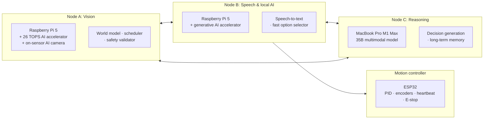
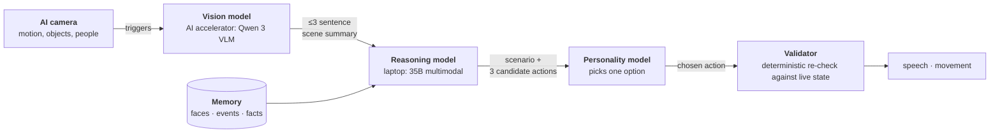
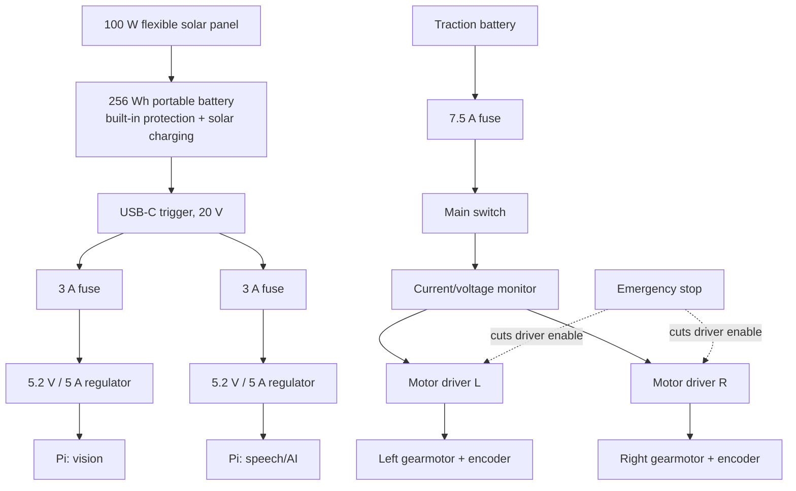
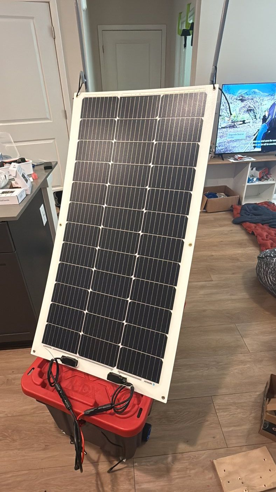

# SPARC: Solar Powered Autonomous Rover Companion

A solar-powered autonomous rover companion that sees, listens, holds a conversation, remembers
people and events, and makes its own decisions, running entirely on local hardware, with no
cloud and no internet dependency.

The whole system runs off a 100 W solar panel and a portable battery. Three computers work
together on board: two Raspberry Pis with AI accelerators handle vision and speech, and a
laptop runs the large reasoning model. A separate microcontroller owns the motors, so no
software crash can leave the wheels running.

## Goals

1. **Run untethered on sunlight.** No wall power, no cloud. A 100 W panel and a 256 Wh
   battery have to carry the entire compute and drive load.
2. **Be always aware without always burning power.** Continuous sensing at near-zero cost,
   with the expensive processors idle until something actually matters.
3. **Never let the AI touch anything dangerous.** The language model may only choose between
   options that ordinary, predictable code generated and will re-check before executing.
4. **Tell the truth.** The robot never claims it did something it did not do. That rule is
   enforced in code, not just in prompts.
5. **Move safely around people.** Deterministic control owns every number that reaches a motor.

---

## The core design principle

> **Always sensing. Not always thinking. Deterministic code owns reality; the AI only advises.**

Every sense uses a cheap, always-on trigger that gates an expensive, on-demand stage. That
single pattern is what makes continuous operation affordable in power, heat, and compute,
and it's what makes a solar budget realistic at all.

```
Vision:  on-sensor detector (always on, ~free)  →  AI accelerator (on demand)  →  large vision model
Audio:   voice activity + wake word (always on) →  speech-to-text (on demand)  →  reasoning model
```

The same idea runs in reverse for motion: the AI picks *what* and *where*, never *how*. Every
number that reaches a motor is produced by deterministic code.

---

## System architecture

Three computers, each with a clearly separated job, talking over a local network.



**Why the jobs are split this way:** vision must never wait behind speech, speech must never
wait behind reasoning, and the motors must never wait behind any of them. Each box owns one
class of work, and the one thing that can hurt someone, the wheels, sits behind a dedicated
microcontroller that keeps running even if every other computer stops.

### Perception ladder

| Tier | Runs on | Rate | Cost | What it answers |
|---|---|---|---|---|
| 0 | On-sensor camera chip | Always on | ~free | "Something or someone is there" |
| 0.5 | Vision accelerator | 1–2 Hz | ~free | What it looks like, semantically; how unusual it is |
| 1 | Vision accelerator | On demand | ~10–30 ms | Who it is, body position, distance |
| 2 | Laptop model | Event-gated | 1–3 s | Intent, ambiguity, "why" |
| 2′ | On-board AI accelerator | Fallback | 2–3 s | Keeps seeing when the laptop is unreachable |

---

## The AI system: a chain of small models, not one big one

Local models are improving fast, but none of them can reliably take raw images and sound in
one end and produce trustworthy motor commands and intent out the other. Ask a single model to
perceive, reason, decide, and act, and you get confident nonsense at the worst possible moment.

So the rover doesn't ask one model to do everything. The work is split across a chain of models,
each with **one narrow, boring job**: summarize this frame. Combine this with memory. Pick one of
these three options. Every stage has a small enough responsibility that it's hard to get wrong,
and its output is small enough to check.

**The result of that constraint:** fewer hallucinations, lower latency, and far fewer tokens
moving through the system, because each model only ever receives what it actually needs.

### The pipeline



| Stage | Runs on | Its one job | What it outputs |
|---|---|---|---|
| **Detection** | On-sensor AI camera | Notice movement, objects, and people | A trigger; no model call unless something happened |
| **Scene summary** | Vision accelerator (Qwen 3 VLM) | Look at the frame and describe it | 3 sentences, maximum |
| **Scenario + options** | Laptop (35B multimodal) | Combine the summary with recent memory: what is happening, what in memory relates to it, and what could be done | A 1–5 sentence scenario and **3 candidate actions**, including speech and movement |
| **Choice** | Personality model | Pick the option that fits who this robot is | One option, a single token |
| **Execution** | Deterministic code | Re-check the choice against live state, then act | Motor commands or speech, or a refusal |

The personality model's entire system prompt is the robot's character. It doesn't reason about
the world or invent actions; it only chooses among options that were already generated and will
still be validated afterward. That's what makes personality safe to have: it can change *which*
reasonable thing happens, never *whether* something unreasonable does.

### Memory

Two things make the robot feel like it knows you rather than just seeing you:

- **Face recognition through a vector database.** Each enrolled face is stored as a vector;
  recognition is a cosine similarity lookup, which is fast enough to run inline without stalling
  the pipeline and cheap enough to re-check constantly.
- **Conversation memory with a sense of time.** A model summarizes what happened and files events
  against *relative* time, so the robot's own recollection reads the way a person's would:
  *"Nick said hi a few minutes ago; Nick entered the room right before that."* Anchoring events to
  each other, instead of to raw timestamps, is what lets the reasoning model reconstruct a
  situation from very few tokens.

Together these are the two hard problems I focused on: **long-term memory that stays true**, and
**responses fast enough to feel like a conversation** rather than a query.

---

## Power system

Two electrically separate power domains that share only a ground reference. Motors create
voltage dips and electrical noise; a Raspberry Pi that browns out can corrupt its storage. So
traction current never touches the compute supply.



**Measured/design budget**

| Load | Typical | Peak allowance |
|---|---:|---:|
| Vision node (Pi + accelerator + camera + cooling) | 10–15 W | 25 W |
| Speech/AI node (Pi + accelerator + camera, storage, audio) | 12–18 W | 25 W |
| Conversion losses + motion controller | 3–6 W | 8 W |
| **Total** | **25–39 W** | **58 W** |

From roughly 220 Wh usefully delivered, that is **about 5.5–8.5 hours** of continuous
operation with no sun. A 100 W panel realistically delivers 20–70 W outdoors, so strong sun
covers the typical compute load and slowly recharges; poor angle, shade, or heat means the
battery still drains, only more slowly.

**Design decisions worth calling out**
- **No separate solar charge controller.** The battery station already contains protection and
  maximum-power-point charging; adding another controller in front of it would fight the input
  and waste power. The panel connects through passive adapters only.
- **A dedicated regulator per Pi instead of the battery's USB ports.** A Pi 5 with accelerators
  wants 5 V at 5 A, but generic USB-C ports advertise their headline wattage only at higher
  voltages. Pulling 20 V once and regulating it down per node gives each computer its own clean,
  independently fused rail, so one node's load can never brown out the other.

---

## Drivetrain and motion control

Deliberately slow and heavily geared: 270:1 gearmotors with quadrature encoders, giving roughly
**0.084 m/s** at the pack's nominal voltage with 65 mm wheels, about 17,280 encoder counts per
wheel revolution. Slow is a feature here: it makes the control loop stable, keeps the robot safe
around people, and leaves the controller a wide useful duty-cycle range.

Motion is built in three layers of authority, where each layer can veto the one above it:

| Layer | Runs on | Rate | Owns |
|---|---|---|---|
| **L2, Cognitive** | Laptop / local AI | ~1 Hz | Symbolic intent: "approach that person", "look there". May be wrong. |
| **L1, Primitives** | Vision Pi | 50 Hz | Closed-loop state machines, smooth velocity profiles, odometry, obstacle gating, timeouts |
| **L0, Reflex/safety** | ESP32 | 200+ Hz | PID velocity control, current limits, emergency stop, heartbeat watchdog |

**Safety rules that are not negotiable, and are enforced in code rather than by the model:**
- Never drive when a person is closer than 0.4 m.
- Maximum 0.35 m/s near people, 0.6 m/s on open floor, always with smooth acceleration ramps.
- Lost heartbeat, stalled sensor, or lost tracking mid-move → **stop**, never continue.
- Every motion ends in a reported terminal state, so the reasoning layer always learns what
  actually happened instead of assuming success.

The motion stack talks to the wheels through a single `MotorDriver` interface, with a simulated
implementation behind it as well as the real one. The whole layer therefore runs on a laptop with
no robot attached, which is how the primitives were developed in the first place, and what
currently lets the decision layer be wired into motor commands before anything moves.

---

## What works today

Running continuously on real hardware:

- **Spoken conversation:** wake-gated listening → speech-to-text → reasoning → spoken reply.
- **Person recognition:** detection, face embedding, and identity resolution against a vector
  database, greeting people by name and enrolling a new face mid-conversation by voice.
- **Long-term memory:** semantic memory with duplicate detection, relative-time event ordering,
  and safeguards against the model inventing facts or fabricating their source.
- **Truthful self-reporting:** the robot is structurally prevented from claiming actions it
  never took, which turned out to be one of the hardest and most important problems in the build.
- **Supervised, self-healing services:** every process restarts automatically and recovers
  after a reboot on all three machines, so the robot comes back on its own after a power cut.

### Roadmap

| Milestone | State |
|---|---|
| Supervised, restartable core | ✅ Shipped |
| Visual cognition: real images inform decisions | ✅ Shipped |
| Reliable local spoken conversation | 🚧 Active |
| Robust multi-person visual identity | 🚧 Active |
| Richer perception: attention, proximity, sound events | Planned |
| Deterministic motion foundation: decisions to motor commands | 🚧 In progress |
| Head movement and social orientation | Planned |
| Safe mobile embodiment | Planned |
| Navigation, docking, and sustained autonomy | Future |

---

## Engineering decisions and trade-offs

The parts of this project I'd most want to talk through in an interview.

**Message bus: MQTT instead of ROS 2.** ROS 2 has no supported install on the Pi OS release
required by the AI accelerator drivers. Rather than fight it, the bus is Mosquitto with typed
messages; because every message is a validated schema object, the boundary, not the transport,
is the contract, and a future migration touches exactly one module.

**Making an unreliable model reliable.** Instead of asking the language model to emit structured
commands, ordinary code builds a lettered menu of valid options and the model returns **a single
letter**, decoded greedily with a one-token limit and clamped in code. The failure surface
shrinks from "parse arbitrary output" to "one character, or fall back." This was the direct
response to discovering that the accelerator's serving layer could not enforce output schemas at
all.

**Budgeting prompts like embedded memory.** The generative accelerator has a hard 4096-token
context ceiling and delivers roughly 9.5 tokens/second, so every prompt has an enforced token
budget and over-budget requests are rejected at the door rather than overflowing mid-generation.

**Separating the motor controller from Linux.** A general-purpose OS cannot make hard real-time
guarantees, and a robot whose wheels depend on a healthy Python process is a robot that runs away
when that process hangs. A dedicated microcontroller owns the millisecond-level motor loop and
enforces a command heartbeat: if the computer stops talking, the wheels stop within 250–500 ms.

**Deliberately slow gearing.** 270:1 gearmotors cap the rover at roughly 0.084 m/s. Slow is the
feature: it keeps the control loop stable, makes the robot safe to develop around people, and
leaves a wide, useful duty-cycle range for the controller instead of living at the bottom of it.

---

## Tech stack

**Hardware:** Raspberry Pi 5 ×2 · 26 TOPS vision accelerator · generative-AI accelerator ·
on-sensor AI camera · ESP32 · BTS7960 motor drivers · 270:1 encoder gearmotors · INA260 power
monitor · 100 W flexible solar panel · 256 Wh LiFePO4 power station · fused dual-domain wiring ·
latching emergency stop

**Software:** Python · Pydantic (typed message contracts) · MQTT · SQLite + vector search ·
C/C++ firmware · systemd / launchd supervision

**Models:** on-sensor object detection · face detection and embedding (vector database with
cosine lookup) · speech-to-text · Qwen 3 vision-language model on the AI accelerator ·
35B multimodal reasoning model running locally on Apple Silicon via MLX · a small personality
model for action selection

---

## Build photos



---

## Code in this repository

The full fleet implementation lives in a separate private repository. What is public here:

| Path | What it is |
|---|---|
| [`firmware/esp32_motion/`](firmware/esp32_motion/) | ESP32 drive and encoder test firmware: quadrature decoding in an interrupt, BTS7960 PWM control, serial command loop. Boots with motors off. |
| [`hardware_tests/`](hardware_tests/) | Pi bring-up scripts: I2C and GPIO discovery, servo channel finder, ultrasonic range check, manual pan-tilt with soft limits. |
| [`docs/EVAL.md`](docs/EVAL.md) | The eval runs that tuned the reasoning prompt and the long-horizon memory path, with pass rates and latencies. |

### The private repo by the numbers

| | |
|---|---|
| Python, excluding tests | 9,600 lines across four packages (common, node A, node B, node C) |
| Tests | 101 pytest cases, hardware mocked by fixtures, runnable on a laptop |
| Commits | 42 since June 2026 |
| Services | 5 supervised daemons across 2 Raspberry Pis (systemd) and 1 Mac (launchd) |
| Reasoning eval | 8/8 scenarios pass with the final persona, 100% schema-valid output over 28 calls, ~4 s per decision at 3 options |
| Memory eval | 6/6 facts distilled from a 16-event scripted day and recalled correctly the next day through the real retrieval path |
| Locked dependencies | separate pinned lockfiles for each node's OS and Python version |

Source access on request.
