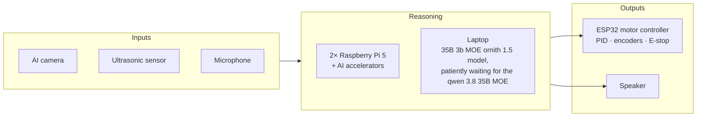

# SPARC: Solar Powered Autonomous Rover Companion

A solar-powered rover that sees, listens, talks, remembers people (embedding model), and decides
what to do on its own, including looking for sunlight to charge. Everything runs on local
hardware. No cloud. Inspired by Wall-E, R2-D2, and Rocky from Project Hail Mary.


The body is a Home Depot plastic storage container. Most of the electronics are repurposed from
earlier projects.

## How it's built

Three computers with dedicated tasks connected locally to each other through ethernet sending commands to a mini ESP32 that controls the motors and servos.


- Power: 100 W flex solar panel, 256 Wh battery, 25 to 39 W typical draw. About 5.5 to 8.5 hours with
  no sun. Compute and motors run on separate fused rails each with smaller battery packs that act as "capacitors"/buffers for stability and to avoid voltage spikes.
- Perception: A raspberry pi ai camera is always on at very low wattage constantly analyzing the scene. A Qwen 3 vision model on
  the accelerator is prompted by that si camera. The 35B 3b MOE model then gets prompted by that accelerator.
- Decisions: the 35B reasoning model proposes three actions (literally Option A, Option B, or
  Option C), a small personality model picks one as a single token, and deterministic code
  re-checks the pick against live state before anything moves or speaks. For example:

  ```
  Input:
    Scene: Alice and Bob appear on screen

  Output:
    Option A:
      Decision: Greet Alice and Bob
      Speech:   "Hey Alice! Hey Bob!"
      Motor:    move forward and face them.

    Option B:
      Decision: Greet only Alice, avoid Bob because he tends to test my behavior with a hockey stick.
      Speech:   "Hey Alice!"
      Motor:    move away from Bob while facing Alice.

    Option C:
      Decision: move away from both Alice and Bob discretely.
      Speech:   ""
      Motor:    move away and avoid eye contact.
  ```

- Memory: faces stored as vectors and matched by cosine lookup. Events filed against relative
  time ("Nick came in right before he said hi").
- Motion: three layers, each able to veto the one above. ESP32 runs PID at 200+ Hz with a
  heartbeat watchdog. Lost heartbeat means stop within 500 ms. A physical E-stop cuts the motor
  drivers.

## What works today

- Spoken conversation, wake word to spoken reply, all local
- Recognizes people by face, greets them by name, enrolls a new face by voice
- Long-term memory with duplicate detection and safeguards against invented facts
- Can't claim an action it didn't take. That's enforced in code.
- Every service restarts on its own after a crash or power cut, on all three machines

## In progress

- Building a dataset to fine-tune the memory model. Dataset generation and the fine-tune both run
  on a DGX Spark.
- CAD model of the rover. It becomes a URDF for Isaac Sim and Gazebo, where the plan is to
  fine-tune an open-source VLA (π0 or similar) for movement: photons in, motor commands out.
- Reliable multi-person identity, then wiring decisions through to motor commands, then safe
  mobile operation. Full roadmap in [docs/DESIGN.md](docs/DESIGN.md).

## Tech

Raspberry Pi 5 ×2 · AI accelerators · on-sensor AI camera · ESP32 · BTS7960 drivers · encoder
gearmotors · INA260 power monitor · Python · Pydantic · MQTT · SQLite + vector search · C/C++
firmware · systemd/launchd · Qwen 3 VLM · Ornith 1.5 35B multimodal model on MLX

## In this repo

| Path | What it is |
|---|---|
| [`firmware/esp32_motion/`](firmware/esp32_motion/) | ESP32 drive and encoder firmware. Quadrature decoding in an interrupt, BTS7960 PWM, serial command loop. Boots with motors off. |
| [`hardware_tests/`](hardware_tests/) | Pi bring-up scripts: I2C and GPIO discovery, servo finder, ultrasonic check, pan-tilt with soft limits. |
| [`docs/DESIGN.md`](docs/DESIGN.md) | Full design notes: architecture, AI pipeline, power, motion, trade-offs. |
| [`docs/EVAL.md`](docs/EVAL.md) | Eval runs that tuned the reasoning prompt and memory path. |

The fleet software is in a private repo: 9,600 lines of Python across four packages, 101 pytest
cases, 5 supervised services. Source access on request.
